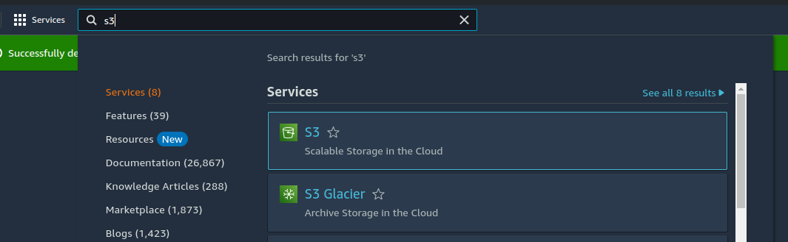
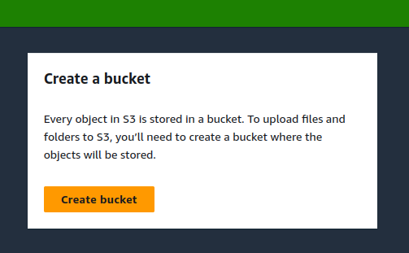
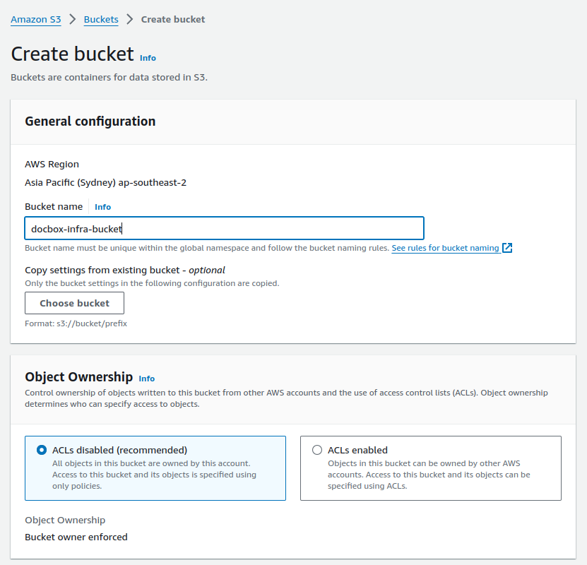
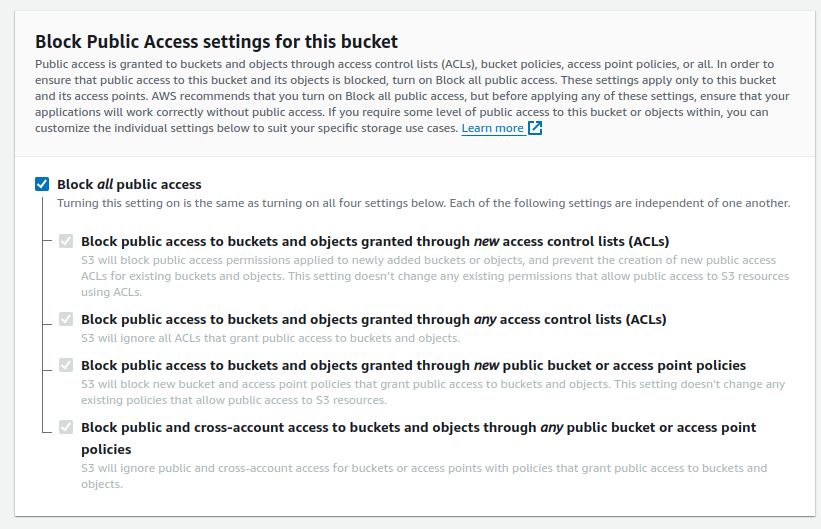
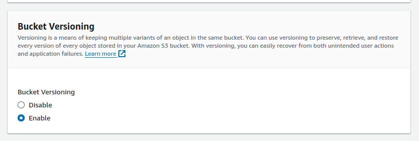
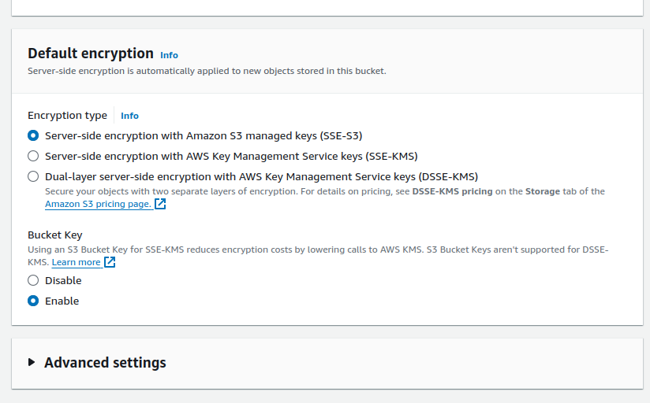
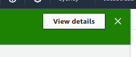
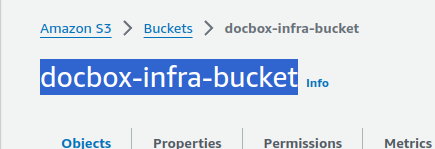

# Terraform S3 Bucket

:::danger IMPORTANT
Terraform uses a state file to track the currently deployed infrastructure. In order to keep this in sync and backed up we will be using the S3 "backend" for terraform which will allow it to store the state in an S3 bucket so we don't have to manually share the state file.
:::

# Create S3 bucket

Search for S3:



Click "Create bucket":



Give the bucket a name:



Ensure public access is blocked:



Enable bucket versioning:

> [!NOTE]
> Terraform recommends enabling bucket versioning 



Ensure encryption is enabled:



Create bucket:


View bucket details:

    

Copy bucket name:



You will use this bucket name for the `aws_infra_bucket` field when setting up the terraform config

After creating the bucket create a `s3.tfbackend` file in the `./terraform` folder in the project root.

In this file put the following:

```r
bucket =  "<THE BUCKET NAME ABOVE>"
key    = "docbox.tfstate"
region = "ap-southeast-2" # Or another region
profile = "<YOUR AWS PROFILE>"
```

With `<YOUR AWS PROFILE>` being your locally configured profile with credentials that have access to the bucket and creation of the various AWS infrastructure that terraform will need to create. 