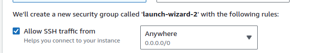
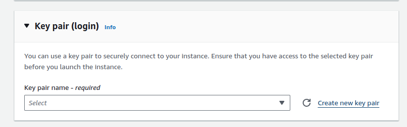
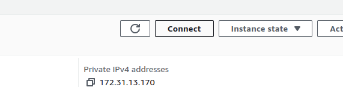
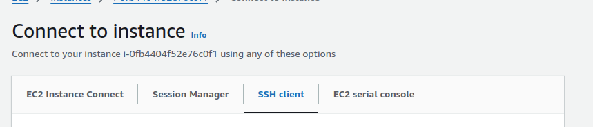
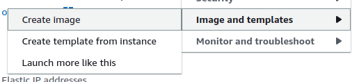
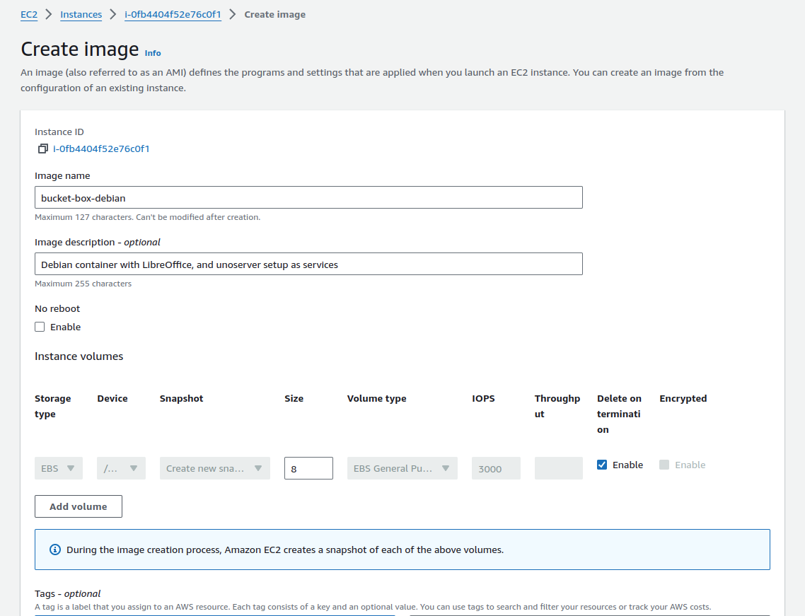
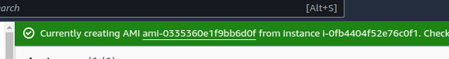
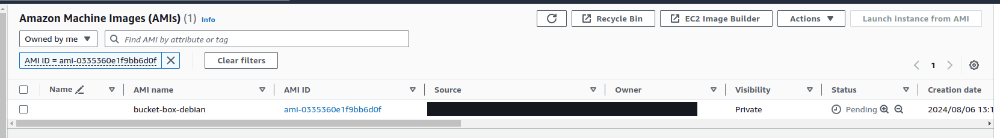
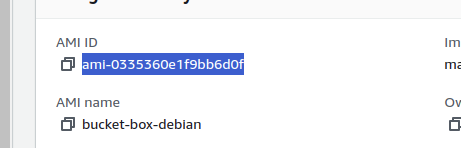

# Setup AMI

## Create EC2 instance

Go to the EC2 page, Launch an instance, selecting "Debian" as the base AMI


Setup a key pair for SSH access:



Select "Allow SSH traffic" and change the "Anywhere" to "My IP"



Follow normal instance creation steps. Ensure you setup an SSH key for accessing the machine

## Get SSH details

After creating the instance and after its started go to the instance and press "Connect":



Click the SSH client tab:



And copy the value under "Connect to your instance using its Public DNS:" you will use this as `<instance-ssh-host>` in the next steps

## Copy the ec2-initial-setup script

Copy the initial setup script to the EC2 instance:

```
scp -i "<path-to-created-ssh-key>" ./scripts/ec2-initial-setup.sh admin@<instance-ssh-host>:/tmp/ec2-initial-setup.sh
```

SSH into the instance:

```sh
ssh -i "<path-to-created-ssh-key>" admin@<instance-ssh-host>
```

Run the setup script as root:


```sh
sudo sh /tmp/ec2-initial-setup.sh
```

From the EC2 instance page on the website press the "Actions" dropdown


then "Images & Templates" then "Create image"



Fill out the image name and description (Rest can be left as is):



Create the image:



Wait for image to create:



Copy AMI ID




Use the AMI ID in the terraform variables